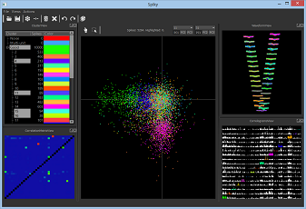

KlustaViewa
===========

**Important (06/06/2014)**: a new version of the entire suite is currently in beta test, [see the instructions here](https://github.com/klusta-team/example).

*KlustaViewa* is a software for semi-automatic spike sorting with high-channel count silicon probes. It streamlines the manual stage occurring after the automatic clustering stage by guiding the user through the clustered data, letting him or her refine the clusters. The goal is to make the manual stage more reliable, quicker, and less error-prone.

This software was developed by Cyrille Rossant in the [Cortical Processing Laboratory](http://www.ucl.ac.uk/cortexlab) at UCL.

User guide
----------

  * [See the user guide here](https://github.com/klusta-team/klustaviewa/blob/master/docs/manual.md).

Screenshots
-----------

Installation
------------

* You'll find the [installation instructions here](https://github.com/klusta-team/example).

