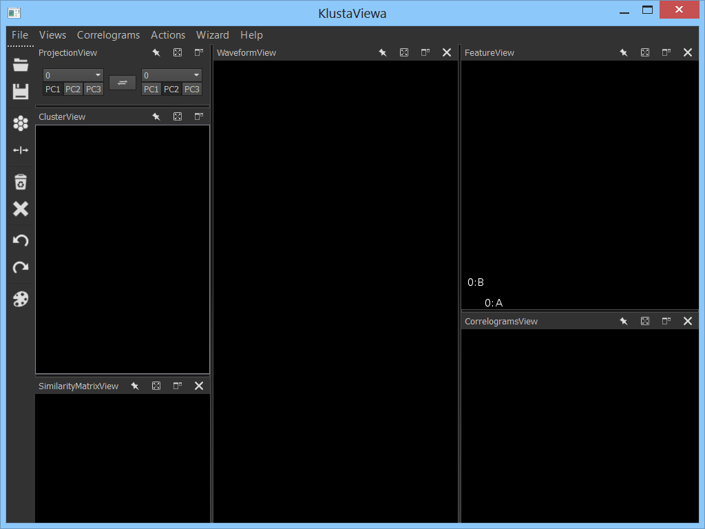
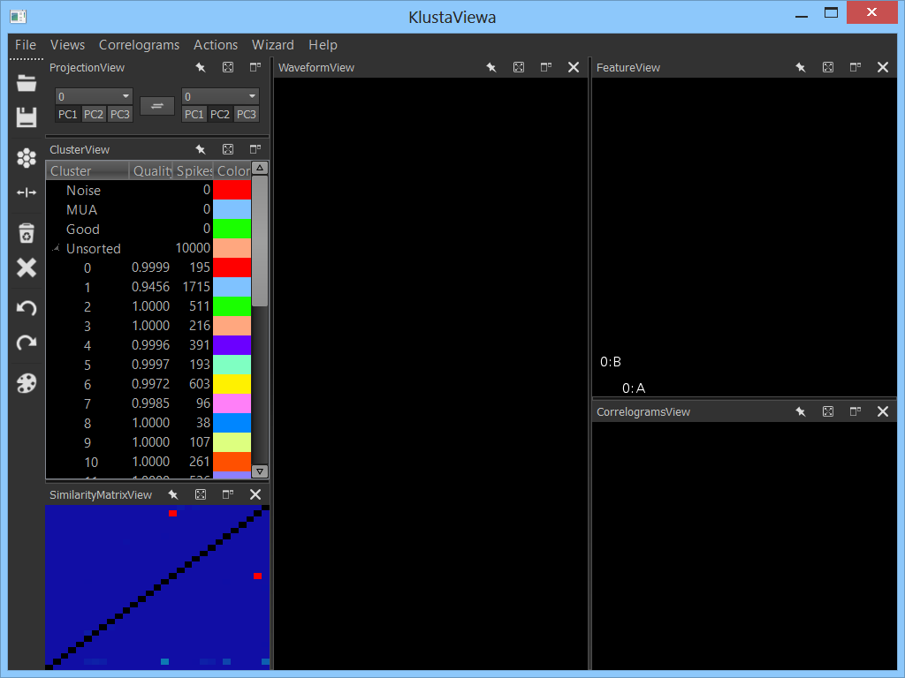
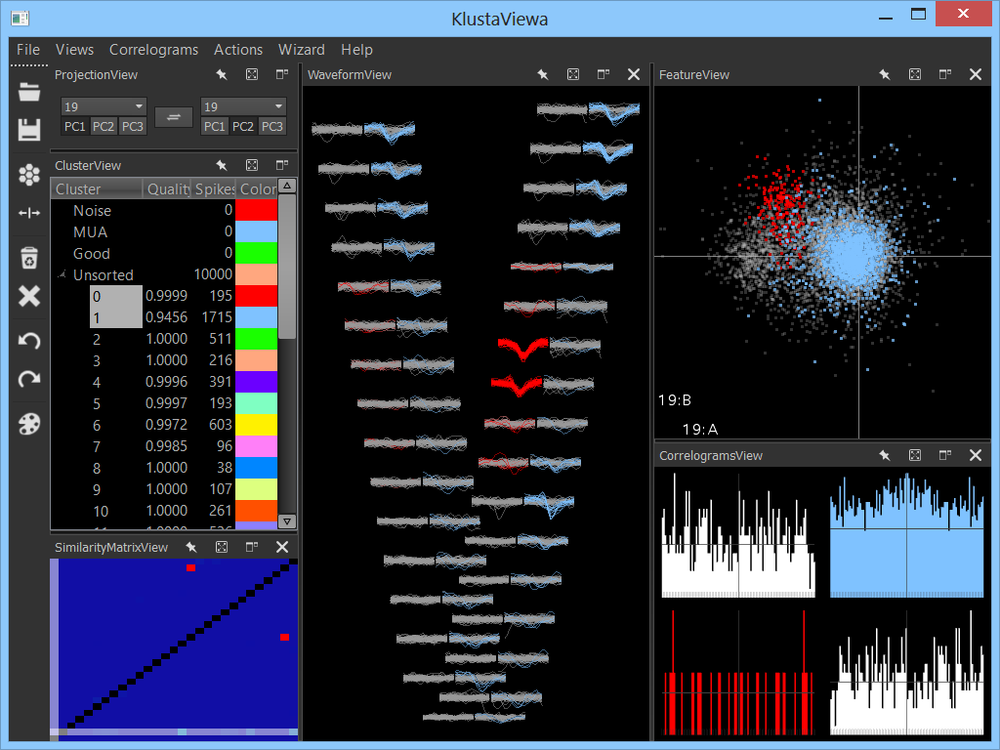
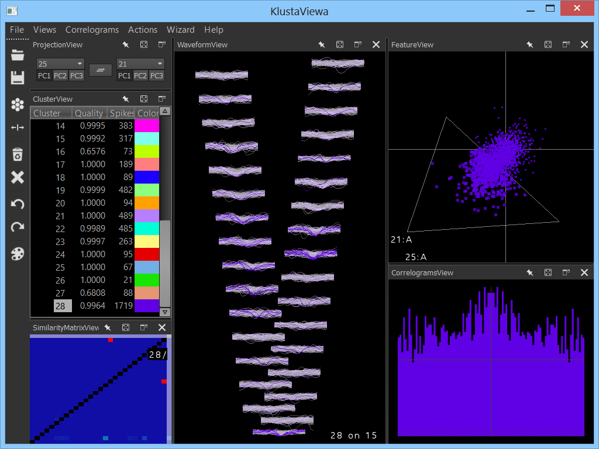
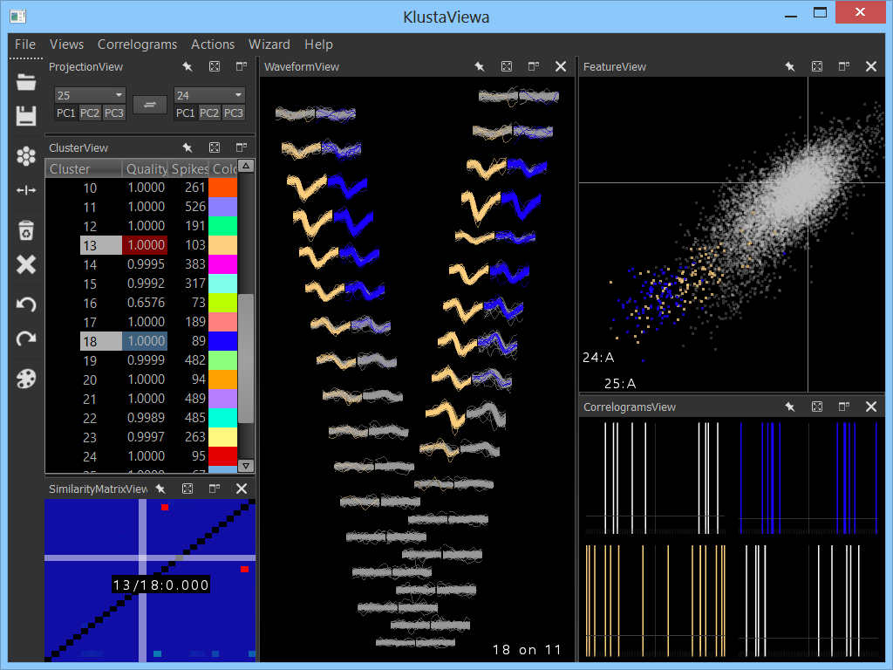
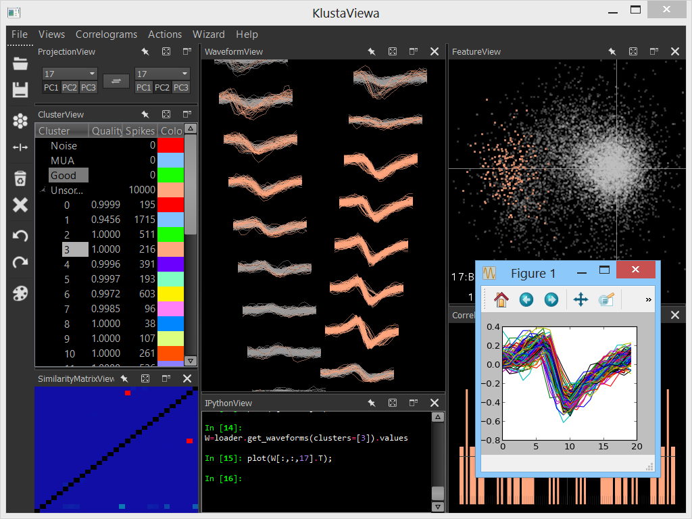

KlustaViewa User Guide
======================

**KlustaViewa** is a software for semi-automatic spike sorting with large dense multi-electrode silicon probes. It is meant to be used *after the automatic clustering stage*. This interface contains a **wizard** that guides the user through the automatically clustered data and lets him or her refine the results. The goal is to make the manual stage more reliable, quicker, and less error-prone.

Installation
------------

The installation procedure can be found on the [main page](https://github.com/klusta-team/klustaviewa). In short, KlustaViewa is a cross-platform software (tested on Windows >= 7, Mac OS X, Linux (Ubuntu, Suse)) and requires Python 2.7 as well as the latest versions of the following external Python packages: NumPy, Pandas, Matplotlib, PyOpenGL, PyQt4, Distribute.

The software uses OpenGL 2.1 so that the visualization features benefit from the hardware acceleration of the graphics card. A reasonably powerful computer is preferable for clustering large datasets (>100,000 spikes): RAM >= 8 GB, and a graphics card that is less than 5 years old.

Users familiar with Python can also install IPython 1.0 to have the possibility to open an IPython console within the software. This console gives interactive access to the data.

### Troubleshooting

Some users might experience problems with OpenGL. In particular, some Windows installations use an obsolete OpenGL version. **You need to be sure that the latest version of your graphics card drivers are installed.** To find out which OpenGL version you have, install and run [OpenGL Extensions Viewer](http://www.realtech-vr.com/glview/). The version needs to be higher than 2.1. If not, you need to install updated graphics card drivers.

User guide
----------

### Launching the software

Once the software has been installed, you can run it from the command line. First, open a console. To open a console on Windows, you can do the following: press "Windows Key + R", type `cmd` and press Enter. Then, type in the console:

    klustaviewa

and press Enter.

### Presentation of the main window

The menu offers access to all commands. The toolbar (on the left, but it can be moved anywhere) contains buttons for most common actions. From top to bottom: Open, Save, Merge, Split, Move to MUA, Move to Noise, Undo, Redo, Override color.

The window contains several views:

  * ClusterView: shows the list of all clusters.
  * WaveformView: shows the waveforms of all spikes in the selected clusters.
  * FeatureView: shows spikes in the feature space.
  * CorrelogramsView: shows the auto- and cross-correlograms of all selected clusters.
  * SimilarityMatrixView: shows the similarity between any pair of clusters.
  * ProjectionView: allows to change the projections in the FeatureView.
  * IPythonView (optional): an interactive IPython console that has access to the data.

The views can be resized, moved, and set floating outside from the main window. The buttons on the top right of each view allow respectively (from left to right) to:

  * pin/unpin the view: when floating and pinned, the view is forced to stay floating even while it is moved on top of the main window,
  * maximize: only active when the view is floating,
  * toggle floating/not floating,
  * close the view.

Views can be created from the *Views* menu.

### Opening a data set

For now, KlustaViewa can only open files in the [Klusters/Neuroscope/NDManager format](http://klusters.sourceforge.net/UserManual/data-files.html). A dataset consists of the following files:

  * `.fet.n` file: the features.
  * `.spk.n` file: the spike waveforms.
  * `.clu.n` file: clusters for each spike.
  * `.(f)mask.n` file: binary or floating mask for each spike (optional, generated by [SpikeDetekt](https://github.com/klusta-team/spikedetekt)).
  * `.probe` file: the probe file used by SpikeDetekt, with an extra variable `geometry`, a dictionary `channel index: (x, y)`. See [this example folder for a list of common probes](https://github.com/klusta-team/klustaviewa/tree/master/examples/probes).
  * `.xml` file: contains important information regarding the data set (sampling frequency, number of channels, etc.)

To open a dataset, select *File > Open* and choose any one of these files (for example, the XML file). All other files from the dataset must be in the same folder.

**The software automatically creates a `.clu_original.n` file with the original cluster values, for backup.**

Other files created and used by the software include:

  * `.cluinfo.n` file: contains information about the clusters. Each line contains: cluster number, color index, group number.
  * `.groupinfo.n` file: contains information about the different groups. Each line contains: group number, group color index, group name.
  * `.kvwlg.n` file: contains the log of all actions performed on the dataset in the software.

KlustaViewa saves the clusters in two files:

  * `.aclu.n`: contains all clusters. Clusters in the noise and MUA groups have arbitrary numbers.
  * `.clu.n`: contains the "good/unsorted" clusters, and clusters in the noise group have been merged into cluster 0, clusters in the MUA group have been merged into cluster 1.
  
The `.clu.n` file is only valid for legacy code that assumes the old Klusters convention (cluster 0 is the noise, cluster 1 is MUA). **The cluster numbers between `.aclu.n` and `.clu.n` do not correspond**.

KlustaViewa loads the `.aclu.n` file as soon as it exists. Otherwise, it loads the `.clu.n` file (this happens in particular when the data set has never been opened in KlustaViewa before), and then creates automatically a new `.aclu.n` file.

### Cluster groups

The clusters are contained in different **groups**. There are four groups by default:

  * *Noise*: clusters containing just noise.
  * *MUA*: clusters containing multi-unit activity and not well separated.
  * *Good*: good clusters, the ones you'll want to keep at the end.
  * *Unsorted*: clusters that have not been sorted yet.

By default, all clusters are in the *Unsorted* group. The goal of the manual stage is to classify all clusters in one of the three other groups.

New groups can be created by right-clicking in the ClusterView. Groups can also be renamed or removed (except the first three groups which cannot be deleted).

### Visualizing the data

One or multiple clusters can be selected in the ClusterView. The corresponding spikes are shown in the WaveformView and FeatureView, and the correlograms are shown in the CorrelogramsView.

In the WaveformView, the probe geometry is shown if a `.probe` file is present in the dataset ( **you may need to press `P` to enable the probe geometry** ). The waveform colors depend on the spike masks: unmasked spikes are colored whereas masked spikes are gray.

In the FeatureView, the spikes belonging to the non-selected clusters are shown in the background in gray.

In all data views, you can visualize the data interactively with the mouse: actions include panning, zooming, changing the channel arrangement in the WaveformView, etc. To obtain the list of all keyboard shortcuts, press H or select *Help>Show shortcuts*. In particular, you can:

  * Pan by moving the mouse while pressing the mouse *left* button.
  * Zoom by moving the mouse while pressing the mouse *right* button.
  * Zoom by scrolling up and down with the wheel.
  * Zoom by moving the mouse while pressing the mouse *middle* button to create a zoom box.

You can also highlight spikes between the FeatureView and WaveformView, by moving the mouse while pressing the left button and the CTRL key in either view.

### Selecting projections

The FeatureView can show any projection in the X and Y axes. There are multiple ways of choosing the projections.

  * In the ProjectionView, select the channel for the X axis (left) or Y axis (right), as well as the Principal Component.
  * In the WaveformView, *CTRL + left click* on a channel to select it for the X axis.
  * In the WaveformView, *CTRL + right click* on a channel to select it for the Y axis.
  * In the FeatureView, press *CTRL while scrolling with the wheel* to cycle through all the channels in the X axis.
  * In the FeatureView, press *SHIFT while scrolling with the wheel* to cycle through all the channels in the Y axis.

### Actions

You can merge and split clusters.

  * To merge all selected clusters, press *G*.
  * To split the selected clusters, you first need to draw a polygon in the FeatureView. Right-click to add points to the polygon, and left-click to terminate the polygon. You can then press *K* to split the clusters.
  
You can undo/redo the last actions.

  
### SimilarityMatrixView

The SimilarityMatrixView shows a similarity matrix of all pairs of clusters. A red value indicates that the two corresponding clusters are similar and might need to be merged. Right-click on the point to select the pair. You can also select more than two clusters by CTRL + right clicking on different pairs.
  

### Using the wizard

The wizard guides you through the data to let you sort the clusters. The wizard proposes you two clusters: a **target cluster** (shown in red in the ClusterView) and a **candidate cluster** (shown in blue in the ClusterView). The target cluster has a high quality, whereas the candidate cluster is likely to be merged in the target cluster. The same target cluster is proposed at first with multiple candidates, by decreasing order of similarity between the target and candidate clusters. The target clusters are selected by decreasing order of quality. The quality value quantifies the separation between the cluster and all other clusters, weighted by the relative size of the cluster.

Start the wizard by pressing SPACE. Then, for each proposition, you have several options:

  * Do nothing (press SPACE): skip the current candidate and select the next candidate, keeping the same target cluster.
  * Merge the candidate and target clusters (press *G*).
  * Delete the candidate (press *CTRL + M* for MUA or *CTRL + N* for noise) and select directly the next candidate for the same target cluster.
  
Once you're done with the current target cluster (i.e. it shouldn't be merged with the remaining candidates), you can *sort* the target cluster and select the next target:

  * Move the target cluster to the *Good* group (press *ALT + G*).
  * Delete the target cluster ( *ALT + M* for MUA, *ALT + N* for noise).
  * Delete both target and candidate clusters ( *CTRL + ALT + M* for MUA, *CTRL + ALT + N* for noise).

The next target cluster is then automatically selected.

Advanced features
-----------------

### Preferences file

A preferences file is stored in `~/.klustaviewa/preferences.py`. The `~` directory refers to your HOME directory. On Linux, it is generally `/home/username/`, whereas on Windows it is generally `C:\Users\username\`. This Python file contains several variables that you can change to customize the software. All details can be found in this file.

### Settings file

A settings file is stored in `~/.klustaviewa/settings`. It contains your user settings (main window arrangement, last opened file, etc.) and is automatically updated every time you use the software. This file should not be modified. You might need to delete it if you encounter some bugs.

### IPython console

If IPython 1.0+ is installed, you can open an IPythonView which gives you access to the data. You can even have custom Python modules automatically loaded by putting them in a directory specified in the `ipython_import_paths` variable of the preferences file.

In the IPython console, the following variables are available:

  * `window`: a `MainWindow` instance that you can use to perform programmatically any action on the software.
  * `loader`: a `Loader` instance that gives you access to the open dataset.
  * `stats`: a `StatsCache` instance that gives you access to the cluster statistics (correlograms and similarity matrix).
  * `wizard`: a `Wizard` instance that gives you access to the wizard.
  
You can use tab completion to find the available methods. For instance, `loader.get_features(clusters=3)` returns a Pandas DataFrame object containing the features of all spikes in cluster 3. Type `%who` to see the list of available variables.

You can perform custom computations interactively on the data and draw plots with Matplotlib.

Troubleshooting
---------------

### Reinitializing the settings

If you encounter any bug, you may try to delete the `~/.klustaviewa/settings.dat` file to reset the settings to the default. You won't lose any data.

